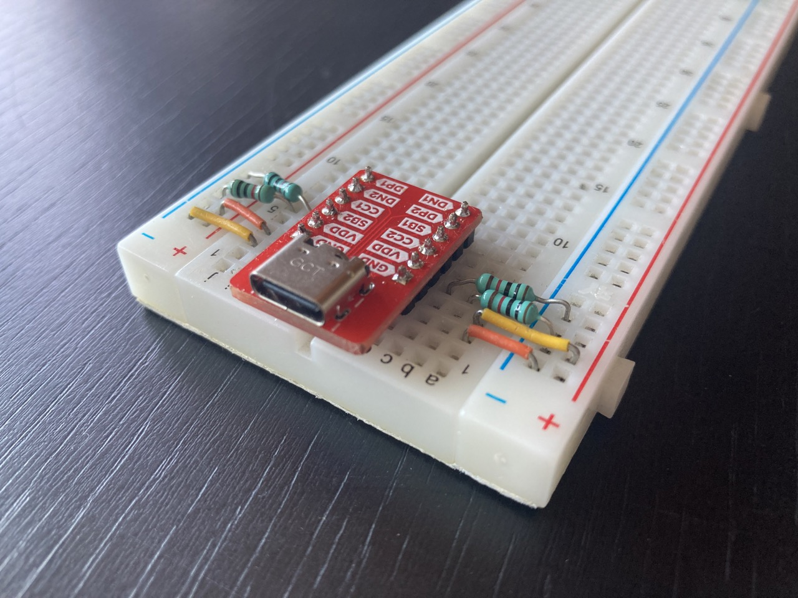
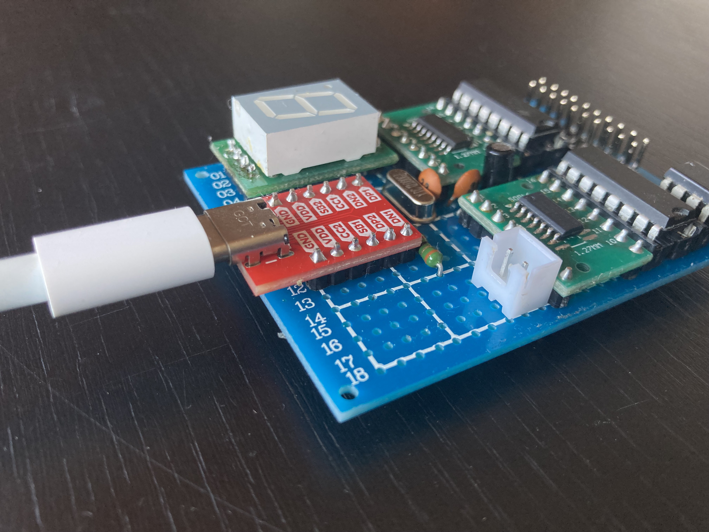

# USB-C Breakout board

I have searched a few places on internet and wasn't able to find a small, cheap and breadboard friendly USB-C adapter that I would like, so I made my own.
It has a neat fanout of all the USB-C pins (without the shield), which are nicely labeled for a very easy use while prototyping.

## Possible usecases:
#### On breadboard:

#### Directly on a prototyping board or a PCB:

## Check out my other PCBs:

- **ESP32-C3 Nano** (in collaboration with [@frycaktadeas](https://github.com/frycaktadeas/)): https://github.com/frycaktadeas/esp32-c3
